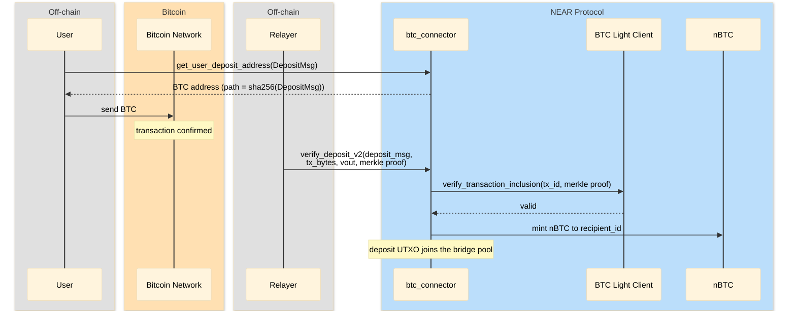
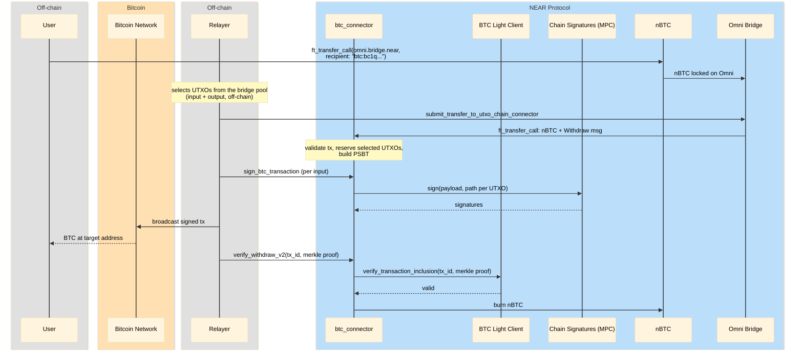

# Bridge Addresses, Deposit & Withdraw

How the bridge controls BTC addresses without holding any private keys, and how the two
main flows work: **deposit goes directly through the btc-connector**, **withdraw goes
back through Omni Bridge**.

## How addresses work

The bridge holds **no private keys**. All BTC addresses are controlled by
[NEAR Chain Signatures (MPC)](https://docs.near.org/chain-abstraction/chain-signatures):
a public key is derived from the MPC root key, the bridge's NEAR account id, and a
derivation `path`. Only the bridge contract can request signatures for its own paths.

| Address | Derivation path | Purpose |
|---------|-----------------|---------|
| Deposit address | `sha256(DepositMsg)` | Unique per deposit message ([`get_user_deposit_address`](https://github.com/Near-One/btc-bridge/blob/e5666eaa16055cf484ab9a539ade0f454845f24c/contracts/satoshi-bridge/src/api/bridge.rs#L283)) |
| Change address | bridge account id | Pooled bridge funds (change outputs of withdrawals) |

Every UTXO stores the path it was received on. When the bridge spends UTXOs, the MPC
signs each input with that UTXO's own path — so deposited funds and pooled funds are
spendable only through the bridge contract.

## Deposit (BTC → nBTC)

Direct, no Omni Bridge: the user sends BTC to their deposit address, a relayer submits
a Merkle proof, the BTC Light Client verifies it, and the connector mints nBTC to
`recipient_id`. The deposit UTXO joins the bridge pool.

## Withdraw (nBTC → BTC)

Via Omni Bridge: the user sends nBTC to Omni Bridge with a `btc:` recipient. The Omni
relayer selects UTXOs from the bridge pool off-chain and calls
`submit_transfer_to_utxo_chain_connector` on Omni Bridge, which forwards the tokens to
the connector with a `Withdraw` message. The connector validates the transaction and
builds the PSBT; the relayer then requests an MPC signature for each input
(`sign_btc_transaction`), broadcasts the signed transaction, and after on-chain
confirmation the nBTC is burned.

## References

- [NEAR Chain Signatures](https://docs.near.org/chain-abstraction/chain-signatures) — MPC key derivation and signing
- [Key Architecture](https://github.com/Near-One/btc-bridge/blob/omni-main/CLAUDE.md#key-architecture) — contracts and trust model
- [`get_user_deposit_address`](https://github.com/Near-One/btc-bridge/blob/e5666eaa16055cf484ab9a539ade0f454845f24c/contracts/satoshi-bridge/src/api/bridge.rs#L283) — deposit address derivation
