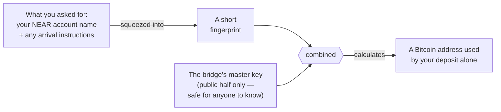
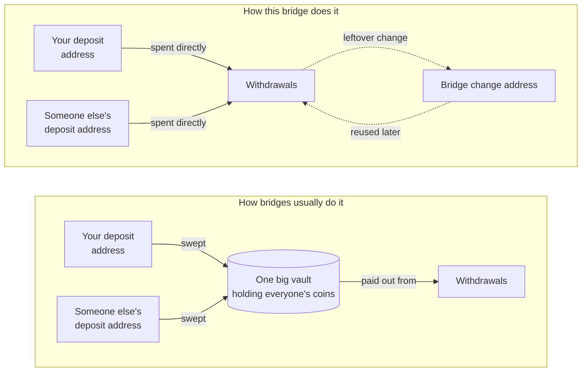
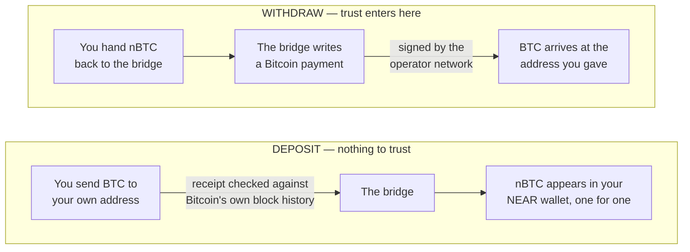
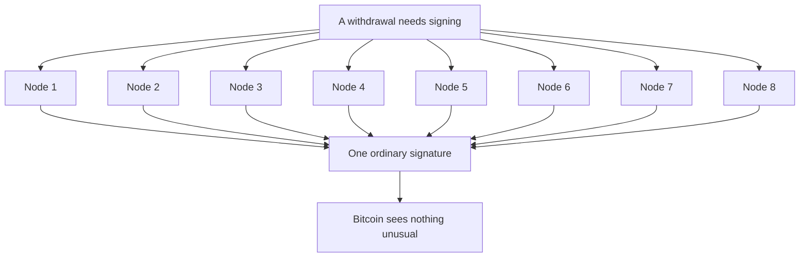

# How the bridge works

A plain-language guide for people using the bridge, not building it. Four things worth
understanding: where your deposit address comes from, why your coins never get swept into a
vault, why going in is safer than coming out, and who actually holds the key.

Every step described here happens on-chain and is publicly checkable.

---

## 1. Your bitcoin gets an address of its own

You never send bitcoin to one shared bridge wallet. You tell the bridge who you are on NEAR —
plus anything you want done with the tokens when they arrive — and it turns that request into an
address that belongs to that request and nothing else.

The address isn't looked up or handed out from a list. It's **calculated**, which means anyone can
recalculate it and confirm those coins were always meant for you. Ask twice with the same details,
get the same address twice. Change one character of the request and you get a completely different
address.

Nothing secret is involved in producing it. The master key ingredient is a public key — the private
half doesn't exist in one piece anywhere (see section 4).

---

## 2. Why there's no vault

Most bridges work like a bank branch: you deposit into an address, the bridge sweeps it into one
large vault wallet, and withdrawals are paid out of that vault. This bridge skips the middle step
entirely. **Your coins stay exactly where you sent them until someone withdraws.**

When someone withdraws, the bridge builds a Bitcoin payment that spends a handful of deposit
addresses directly as its funding. Each of those addresses is signed for **separately, with its own
key** — a withdrawal drawing on three deposit addresses needs three independent signatures, not one
master signature over everything.

### What that buys you

- **No honeypot.** There is no single address that ever holds everyone's coins, so there is no
  single address worth attacking. An attacker who somehow compromised one deposit address would
  reach exactly one deposit.
- **No extra hop.** A sweep is a real Bitcoin transaction: it costs a fee, takes confirmations, and
  creates a window where your coins are in motion between two places the bridge controls. Skipping
  it removes all three.
- **Nothing to drain.** Because each address needs its own signature from the operator network,
  there is no single approval that moves the whole pot.
- **Auditable by anyone.** Since deposit addresses are calculated rather than assigned, you can
  verify independently which deposit any coin belongs to — no need to take the bridge's word for it.

### The one exception: change

Bitcoin payments can't spend part of an address — they spend it whole and send the remainder back
as *change*, the way handing over a note gets you coins back. Withdrawal amounts rarely match
deposit amounts exactly, so leftovers do accumulate at a single bridge-controlled change address
(itself calculated from the bridge's own account name, by the same recipe as section 1). Later
withdrawals reuse that change as funding.

So the bridge does end up with a working balance in one place — but it arrives as **change from
spending**, never as a sweep of your deposit. Your coins are never moved just to be stored
somewhere else, and the change address is protected by exactly the same signing rules as everything
else.

---

## 3. One direction is proved. The other is signed.

Bitcoin coming in and bitcoin going out are not mirror images, and this is the single most important
thing to know about the bridge.

**Coming in**, the bridge is shown a receipt from Bitcoin's own history and checks it. Either the
receipt holds up or nothing happens. There is no one to take your word for it, and no one whose
word you have to take. Anyone can submit the receipt — if one relayer disappears, another can do it.

**Going out**, someone has to actually sign a Bitcoin payment on your behalf. That's a decision, not
a check, and it's where trust enters the picture.

---

## 4. The key doesn't exist in one piece

There is no server with the bridge's private key on it, and no person who could be persuaded to hand
it over. The key is split across eight independent operators, and each one holds a fragment that is
useless on its own.

Each operator computes its own piece of the answer and the pieces combine into a single
ordinary-looking signature. Bitcoin can't tell it apart from one made by a lone wallet, and no
operator ever sees the whole key — not even while signing.

Take away any single operator and the signature still forms. Take away the group and no one —
including the bridge's own developers — can move the coins.

---

## In short: what you're actually trusting

| | Bitcoin → nBTC | nBTC → Bitcoin |
|---|---|---|
| **You trust** | Nobody | The operator network |
| **What settles it** | Evidence from Bitcoin's own history | A signature the operators produce together |
| **Can one bad actor break it?** | No — a forged receipt fails the check | No — no single operator can sign |
| **Can everyone going offline stop it?** | No — anyone can submit the receipt | Yes — signing needs the group |

And in both directions: your coins sit at an address derived from your own deposit request, never
pooled into a vault, until the moment they're spent.