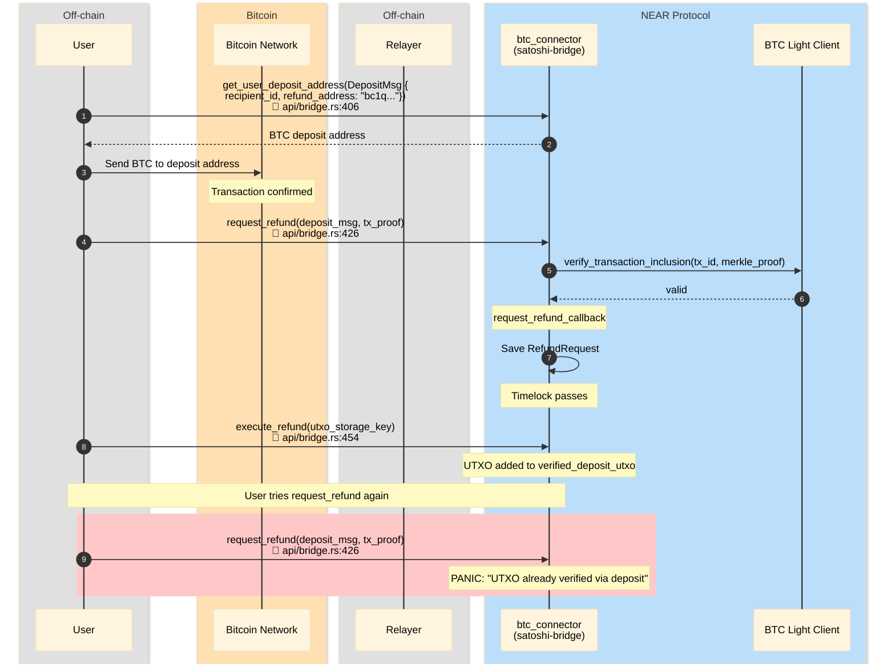

# Refund — second request_refund after execute blocked

User requests refund, executes it. Then tries `request_refund` again
for the same UTXO — fails because `execute_refund` marked the UTXO
in `verified_deposit_utxo`.

## File References

| # | Method | File |
|---|--------|------|
| 1 | `get_user_deposit_address` | `contracts/satoshi-bridge/src/api/bridge.rs:406` |
| 2 | `request_refund` | `contracts/satoshi-bridge/src/api/bridge.rs:426` |
| 3 | `verify_transaction_inclusion` | `contracts/satoshi-bridge/src/btc_light_client/mod.rs:113` |
| 4 | `request_refund_callback` | `contracts/satoshi-bridge/src/refund.rs` |
| 5 | `execute_refund` | `contracts/satoshi-bridge/src/api/bridge.rs:454` |

## Sequence Diagram

