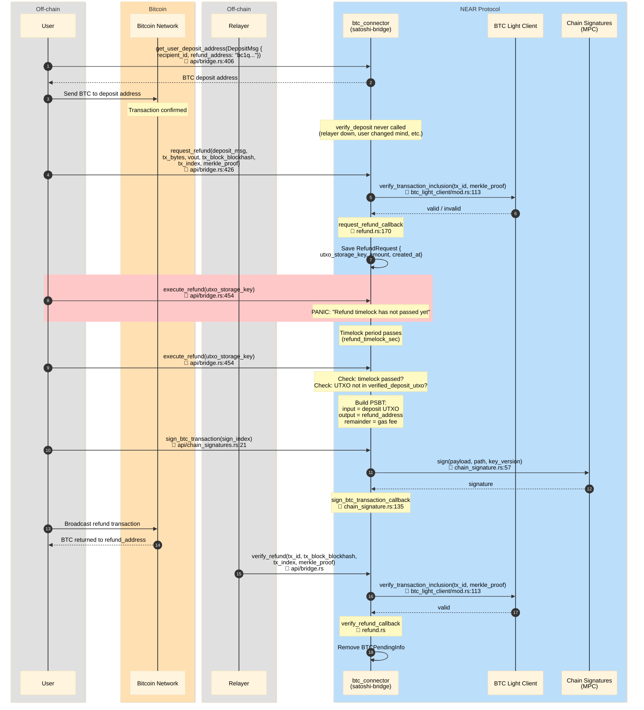

# Refund Flow (BTC → BTC, deposit never finalized)

User deposited BTC with `refund_address` in DepositMsg, but `verify_deposit` was never called.
Anyone who knows the deposit_msg can request a refund. After timelock passes, DAO/Operator
executes the refund — BTC is sent back to the refund address.

## File References

| # | Method | File |
|---|--------|------|
| 1 | `get_user_deposit_address` | `contracts/satoshi-bridge/src/api/bridge.rs:406` |
| 2 | `DepositMsg.refund_address` | `contracts/satoshi-bridge/src/deposit_msg.rs:27` |
| 3 | `request_refund` | `contracts/satoshi-bridge/src/api/bridge.rs:426` |
| 4 | `verify_transaction_inclusion` | `contracts/satoshi-bridge/src/btc_light_client/mod.rs:113` |
| 5 | `request_refund_callback` | `contracts/satoshi-bridge/src/refund.rs:170` |
| 6 | `execute_refund` | `contracts/satoshi-bridge/src/api/bridge.rs:454` |
| 7 | `sign_btc_transaction` | `contracts/satoshi-bridge/src/api/chain_signatures.rs:21` |
| 8 | `sign` (MPC) | `contracts/satoshi-bridge/src/chain_signature.rs:57` |
| 9 | `sign_btc_transaction_callback` | `contracts/satoshi-bridge/src/chain_signature.rs:135` |
| 10 | `verify_refund` | `contracts/satoshi-bridge/src/api/bridge.rs` |
| 11 | `verify_refund_callback` | `contracts/satoshi-bridge/src/refund.rs` |

## Sequence Diagram

