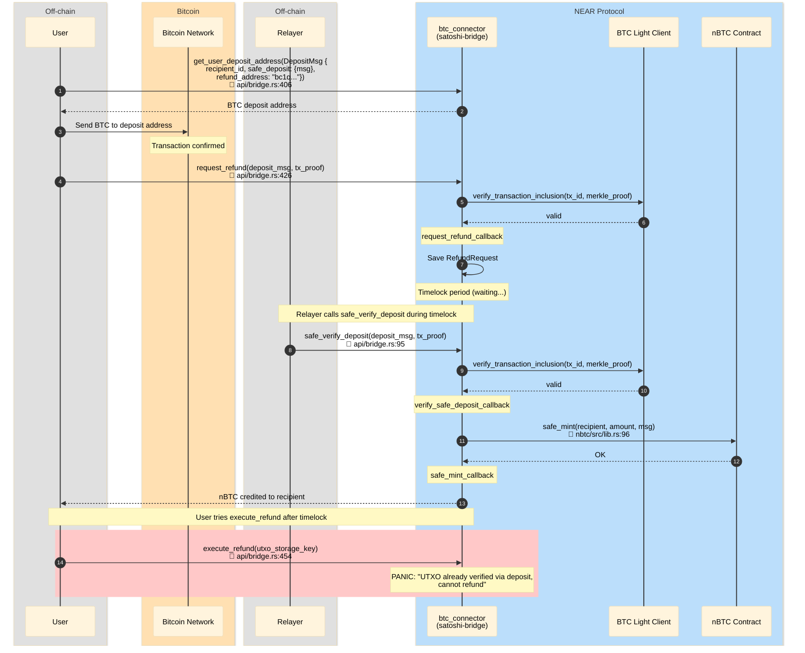

# Refund Race — safe_verify_deposit wins before execute_refund

User requests refund, but during timelock period the Relayer calls `safe_verify_deposit`
(OmniBridge integration). Safe deposit succeeds, UTXO is marked in `verified_deposit_utxo`.
When user tries `execute_refund` — it fails because UTXO is already finalized.

## File References

| # | Method | File |
|---|--------|------|
| 1 | `get_user_deposit_address` | `contracts/satoshi-bridge/src/api/bridge.rs:406` |
| 2 | `request_refund` | `contracts/satoshi-bridge/src/api/bridge.rs:426` |
| 3 | `verify_transaction_inclusion` | `contracts/satoshi-bridge/src/btc_light_client/mod.rs:113` |
| 4 | `request_refund_callback` | `contracts/satoshi-bridge/src/refund.rs` |
| 5 | `safe_verify_deposit` | `contracts/satoshi-bridge/src/api/bridge.rs:95` |
| 6 | `verify_safe_deposit_callback` | `contracts/satoshi-bridge/src/btc_light_client/deposit.rs:179` |
| 7 | `safe_mint` | `contracts/nbtc/src/lib.rs:96` |
| 8 | `safe_mint_callback` | `contracts/satoshi-bridge/src/btc_light_client/deposit.rs:214` |
| 9 | `execute_refund` | `contracts/satoshi-bridge/src/api/bridge.rs:454` |

## Sequence Diagram

