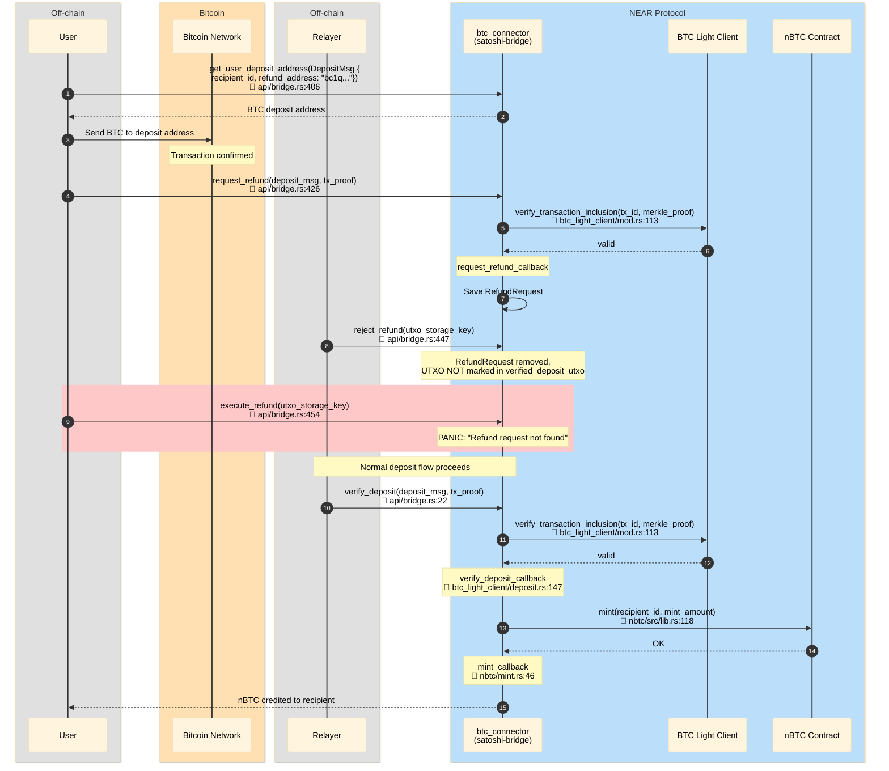

# Refund Reject → Deposit succeeds

User requests refund, DAO rejects it. After rejection the UTXO is NOT marked
in `verified_deposit_utxo`, so normal `verify_deposit` works and nBTC is minted.

## File References

| # | Method | File |
|---|--------|------|
| 1 | `get_user_deposit_address` | `contracts/satoshi-bridge/src/api/bridge.rs:406` |
| 2 | `request_refund` | `contracts/satoshi-bridge/src/api/bridge.rs:426` |
| 3 | `verify_transaction_inclusion` | `contracts/satoshi-bridge/src/btc_light_client/mod.rs:113` |
| 4 | `request_refund_callback` | `contracts/satoshi-bridge/src/refund.rs` |
| 5 | `reject_refund` | `contracts/satoshi-bridge/src/api/bridge.rs:447` |
| 6 | `verify_deposit` | `contracts/satoshi-bridge/src/api/bridge.rs:22` |
| 7 | `verify_deposit_callback` | `contracts/satoshi-bridge/src/btc_light_client/deposit.rs:147` |
| 8 | `mint` | `contracts/nbtc/src/lib.rs:118` |
| 9 | `mint_callback` | `contracts/satoshi-bridge/src/nbtc/mint.rs:46` |

## Sequence Diagram

